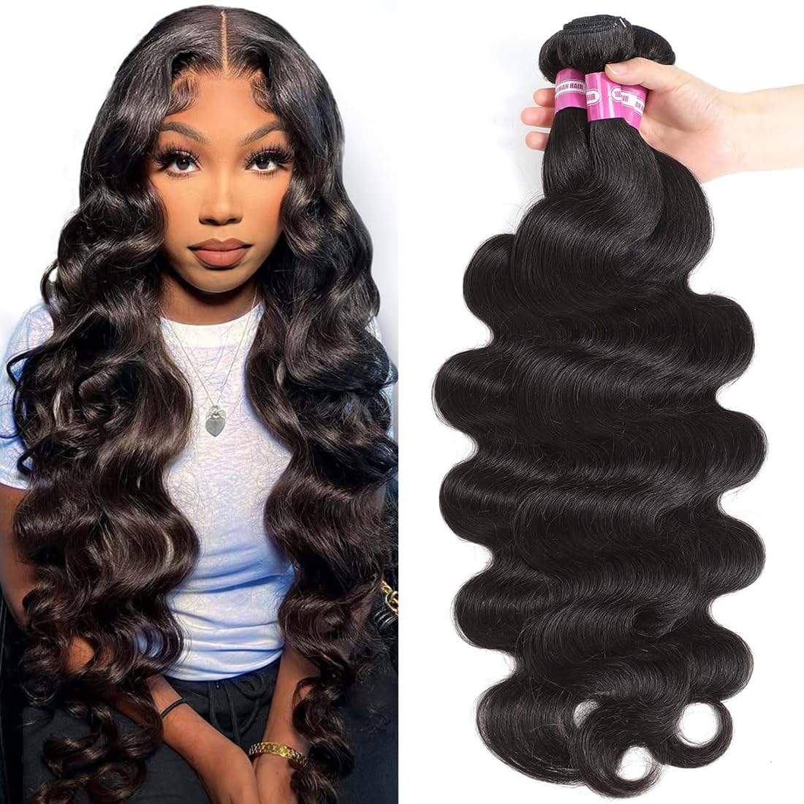

# FCB-Project
## Onboarding Project
---
This data analysis project aims to generate insight into the human hair business in Nigeria.
Understanding the intricacies of the human hair business in Nigeria is paramount for various stakeholders, including policymakers, investors, entrepreneurs, and researchers. Despite its prominence, there exists a dearth of comprehensive empirical studies that delve into the dynamics, challenges, and opportunities inherent in this industry. Thus, this research endeavors to fill this gap by conducting a meticulous data-driven analysis aimed at elucidating the various facets of the human hair business in Nigeria.

## Data sources
The primary source of data used here is Human Hair.csv and this is an open source data that can be freely downloaded from an open source online such as [Kaggle](https://www.kaggle.com/) or [Fred](https://fred.stlouisfed.org/) or any other data repository site.

## Tools used
- Microsoft Excel [Download Here](http://microsoft.com)
- Microsoft
- Power Bi
- Python
- *Google sheets*
- **SQL**

  ```
  Google query sheet
  SELECT * FROM TABLE 1
  WHERE CONDITION = MET

  ```

  
    
